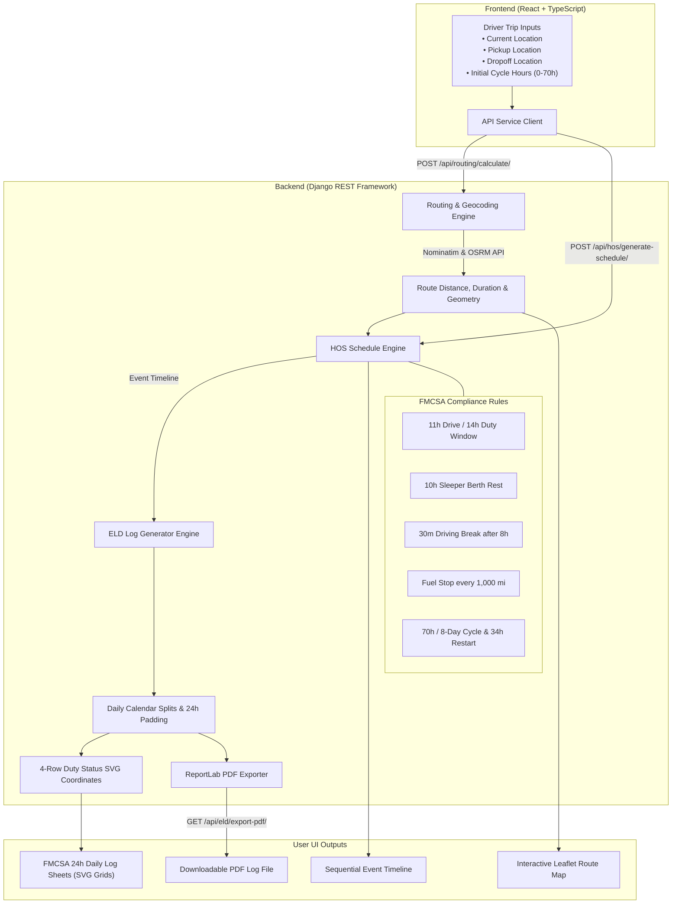

# Dispatcher - Full-Stack HOS & ELD Log Route Planner

A full-stack commercial truck dispatching, route optimization, and FMCSA Electronic Logging Device (ELD) daily log generator built with **Django REST Framework** and **React + TypeScript**.


---

## 📋 Features & Capability Highlights

- **Route Planning & Interactive Mapping**: Uses OpenStreetMap & Leaflet with OSRM routing to map origin, pickup, dropoff, and calculated rest/fuel stops.
- **FMCSA Hours of Service (HOS) Engine**: Automatically schedules driving shifts, mandatory 30-minute breaks, 10-hour sleeper berth rests, and 34-hour weekly restarts.
- **Visual ELD Daily Log Sheets**: Renders standard FMCSA 24-hour 4-row duty status graph grids (**Off Duty, Sleeper Berth, Driving, On Duty**) with seamless transitions.
- **Multi-Day Trip Log Generation**: Long-haul trips spanning multiple calendar days automatically split into tabbed, daily log sheets.
- **PDF Export Engine**: Exports official daily log sheets directly to PDF documents for inspection.
- **Fuel Stop Planning**: Automatically enforces refueling at least once every 1,000 miles.

---

## 📥 Required Inputs & Business Rules

### Inputs

1. **Current Location**: Driver's starting origin city or coordinates.
2. **Pickup Location**: Cargo pickup location (1 hour allocated for loading & pre-trip inspection).
3. **Dropoff Location**: Cargo destination location (1 hour allocated for unloading & post-trip inspection).
4. **Current Cycle Hours Used**: Existing accumulated duty hours (0 – 70 hours).

### FMCSA Rules & Assumptions

- **Property-Carrying Driver**: 70 hours in 8 days cycle rule.
- **Driving Shift Limits**: 11 hours maximum driving per duty period.
- **Duty Window**: 14 hours maximum duty period window before driving is prohibited.
- **Mandatory Off-Duty Rest**: 10 consecutive hours sleeper berth / off-duty rest required between shifts.
- **Driving Break**: 30-minute break required after 8 cumulative hours of driving.
- **Refueling**: Mandatory fuel stop scheduled every 1,000 miles (30-minute duration).
- **Cargo Dwell Time**: 1 hour allocated at pickup and 1 hour allocated at dropoff.

---

## 🔄 Application Flow & System Architecture



---

## 🛠️ Tech Stack

| Component    | Technology                   | Description                                                          |
| :----------- | :--------------------------- | :------------------------------------------------------------------- |
| **Backend**  | Python, Django, DRF          | REST API endpoints for HOS scheduling, routing, & ELD log generation |
| **Frontend** | React 18, TypeScript, Vite   | Single Page Application with interactive controls & real-time UI     |
| **Styling**  | Tailwind CSS, Lucide         | Responsive enterprise dashboard UI design                            |
| **Mapping**  | Leaflet, React-Leaflet, OSRM | Free map tiles, polyline rendering, and route geometry               |
| **Database** | PostgreSQL / SQLite          | Stores trips, logs, duty events, and user authentication             |

---

## 🚀 Quick Start Guide

### Prerequisites

- Python 3.10+
- Node.js 18+ & npm/pnpm

### 1. Backend Setup (Django)

```bash
cd backend
# Install dependencies
uv sync --frozen

# Run migrations & seed data
uv run python manage.py migrate

# Run unit tests (52 tests)
uv run python manage.py test

# Start Django dev server
uv run python manage.py runserver 8000
```

### 2. Frontend Setup (React)

```bash
cd frontend

# Install dependencies
pnpm install

# Typecheck code
npx tsc --noEmit

# Start Vite dev server
pnpm run dev
```

Open [http://localhost:5173](http://localhost:5173) in your browser to view the application.

---

### 3. Pre-Commit Hooks (Frontend & Backend)

Run the pre-commit script manually or install Git hooks:

```bash
# Run pre-commit checks (Linter, TypeScript, Ruff, & Django Tests)
bash scripts/pre-commit.sh

# Or install Git hook automatically
git config core.hooksPath .husky
```

---

## 📜 Project Structure

```text
dispatcher/
├── backend/
│   ├── config/            # Django project settings & URLs
│   ├── hos/               # Hours of Service calculation engine & services
│   ├── eld/               # ELD daily log generator & SVG/PDF renderers
│   ├── routing/           # Route calculation & geocoding services
│   ├── trips/             # Trip CRUD endpoints & models
│   ├── users/             # Authentication & user profiles
│   └── manage.py
└── frontend/
    ├── src/
    │   ├── components/    # Common layout components (Navbar, Footer, Container)
    │   ├── features/      # Feature modules (hos, eld, routing, optimization, trip)
    │   ├── App.tsx        # Main application routing & views
    │   └── main.tsx
    ├── package.json
    └── vite.config.ts
```

---

## 📄 License

This project is open-source and available under the MIT License.
