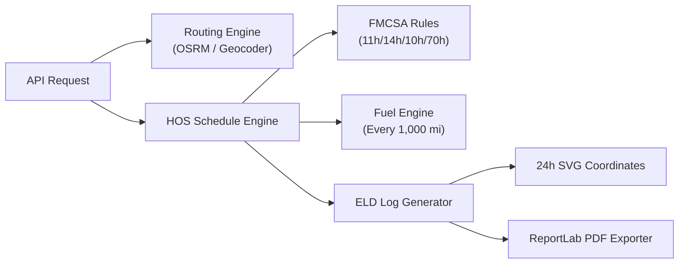

# Dispatcher Backend - Django REST Engine

Django backend API services powering the Dispatcher HOS Compliance Engine, ELD Daily Log Generator, and OSRM Route Optimizer.


---

## 🏗️ Architecture & Modules



The backend is organized into modular Django apps:

- **`hos`**: Contains `ScheduleEngine`, `HOSEngine`, `CycleEngine`, and `FuelEngine`. Implements FMCSA rules (11h drive, 14h duty window, 10h sleep, 30m break, 70h/8d cycle, fuel stop every 1,000 miles).
- **`eld`**: Contains `ELDLogGenerator`, `ELDGraphRenderer`, and `PDFExportService`. Converts HOS event timelines into calendar-day daily log sheets, 4-row SVG grid coordinates, and printable PDF documents.
- **`routing`**: Interfaces with free OSRM map APIs and Nominatim geocoders to compute distance, driving duration, and route geometry points.
- **`trips`**: Manages trip state, user itineraries, and custom stop points.
- **`users`**: User authentication, JWT tokens, and profile management.

---

## 🛠️ Setup & Running

### Requirements

- Python 3.10+

### Setup Commands

```bash
# Navigate to backend directory
cd backend

# Install requirements
pip install uv
uv sync --frozen

# Apply migrations
uv run python manage.py migrate

# Execute Unit Tests (52 Tests)
uv run python manage.py test

# Start server
uv run python manage.py runserver 8000
```

---

## 📡 Primary API Endpoints

| Method     | Endpoint                            | Description                                                                         |
| :--------- | :---------------------------------- | :---------------------------------------------------------------------------------- |
| `POST`     | `/api/hos/generate-schedule/`       | Generates HOS event timeline based on distance, duration, and cycle hours           |
| `POST`     | `/api/eld/generate-logs/`           | Generates 24-hour FMCSA daily log sheets and graph data                             |
| `GET`      | `/api/eld/export-pdf/?trip_id=<id>` | Exports daily log sheets as a downloadable PDF document                             |
| `POST`     | `/api/routing/calculate/`           | Calculates route polyline & distance between current, pickup, and dropoff locations |
| `GET/POST` | `/api/trips/`                       | Retrieves or creates trip itineraries                                               |
