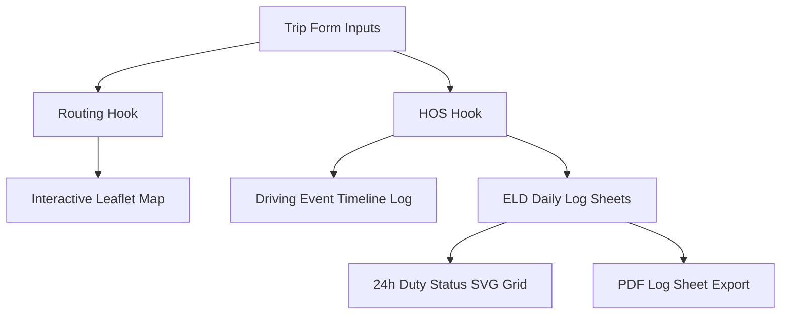

# Dispatcher Frontend - React + TypeScript SPA with Tanstack

Single-page Web Application for commercial truck dispatching, route visualization, and FMCSA ELD daily log sheet drawing.


---

## 🎨 Feature Overview



- **Interactive Route Map (`RouteMap` / `StopMap`)**: Interactive Leaflet map with OpenStreetMap tiles displaying trip polylines, current/pickup/dropoff markers, and rest stops.
- **24-Hour Duty Status Graph Grid (`LogGraph`)**: Custom SVG graph grid rendering the 4 FMCSA duty statuses (**Off Duty, Sleeper Berth, Driving, On Duty**) with interactive hour segment hover inspection.
- **Multi-Day Tabbed Daily Logs (`ELDViewer`)**: Multi-day trip logs rendered with tabbed day views, daily summary stats, driver info cards, and PDF export triggers.
- **Stop Optimization & Simulation (`OptimizationPage`)**: Controls for fuel station brand preferences, toll avoidance, fuel reserve thresholds, and stop timeline editing.

---

## 🚀 Development & Build

### Requirements

- Node.js 18+
- npm or pnpm

### Commands

```bash
# Navigate to frontend directory
cd frontend

# Install dependencies
pnpm install

# Typecheck TypeScript
npx tsc --noEmit

# Start development server
pnpm run dev

# Build for production
pnpm run build
```

---

## 📁 Feature Architecture

```text
frontend/src/features/
├── eld/            # Daily log cards, SVG graph grid, summary tables, PDF export button
├── hos/            # Hours of Service timeline, clock widgets, cycle progress gauges
├── optimization/   # Route stop optimization panels, alternative routes, simulation controller
├── routing/        # Trip input form, geocoding hook, interactive Leaflet map component
├── trip/           # Saved trip lists and itinerary management
└── auth/           # Login and Registration views & auth context
```
